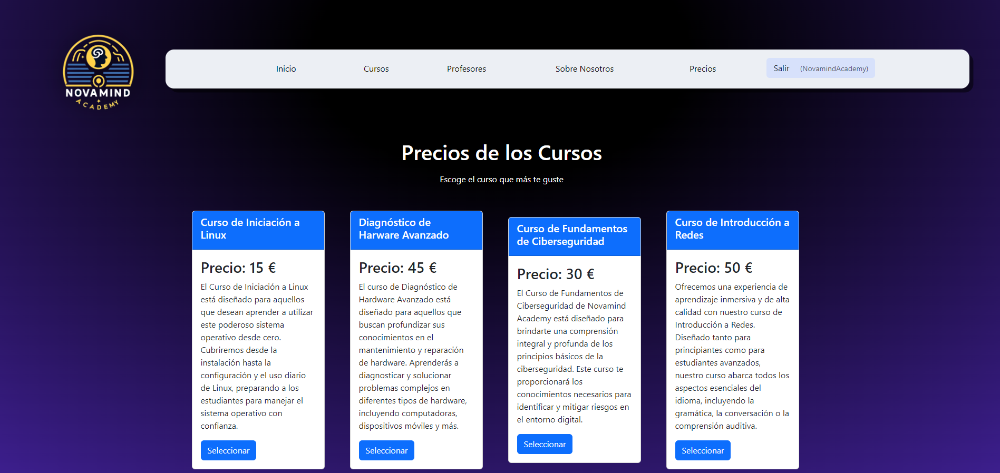

# NOVAMIND ACADEMY

 

## Descripción 
Repositorio del TFG sobre Novamind Academy, una plataforma web construida con Django para gestionar las operaciones de una academia de cursos sobre informática. Este sistema proporciona funciones para gestionar cursos, estudiantes y profesores. El sistema está diseñado para ser intuitivo, accesible y escalable, proporcionando una experiencia fluida para todos los usuarios, incluidos administradores, profesores y estudiantes.

 

## Autores
- Martín Vera Ceca
- Marco Rodriguez-Rey Zapata
- Javier Pérez Vicente

 

## Interfaz

 

 

## Características
- Gestión de usuarios (estudiantes, profesores, administradores)
- Inscripción y gestión de cursos
- Asignación de profesores a cursos
- Seguimiento y evaluación del progreso de los estudiantes
- Procesamiento de pagos y facturación
- Notificaciones automáticas y manuales
- Generación de reportes y análisis

## Tecnologías Utilizadas
- Backend: Django
- Frontend: HTML, CSS & JavaScript
- Base de datos: MySQL o PostgreSQL
- Herramientas de diseño: Adobe, Sketch, Figma
- Frameworks: Bootstrap (en consideración)
- Servidores: AWS, Azure o Google Cloud

 
