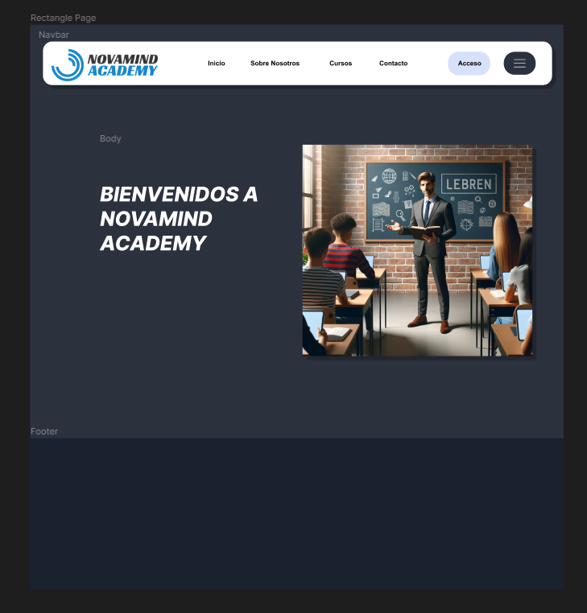

# Sistema de Gestión NOVAMIND ACADEMY

Bienvenido al Sistema de Gestión de Academia de Idiomas, una aplicación web construida con Django para gestionar las operaciones de una academia de idiomas. Este sistema proporciona funciones para gestionar cursos, estudiantes, profesores y horarios de clases.

## Características

- Autenticación y autorización de usuarios
- Gestión de cursos
- Gestión de estudiantes
- Gestión de profesores
- Programación de clases
- Seguimiento de asistencia
- Generación de informes

## Tecnologías Utilizadas

- Django 4.0
- MySQL
- HTML/CSS
- Bootstrap
- JavaScript

## Captura de Pantalla

A continuación se muestra una captura de pantalla de la página de inicio de la aplicación:



En esta imagen, se puede observar la barra de navegación con las opciones de Inicio, Sobre Nosotros, Cursos, Contacto y Acceso. También se muestra una sección de bienvenida con un mensaje "BIENVENIDOS A NOVAMIND ACADEMY" junto a una imagen que representa un aula de clases.

## Comenzando

Sigue estas instrucciones para obtener una copia del proyecto y ejecutarlo en tu máquina local para propósitos de desarrollo y pruebas.

### Requisitos Previos

- Python 3.11+
- Django 4.0+
- MySQL

### Instalación

1. **Clona el repositorio:**

    ```bash
    git clone https://github.com/tuusuario/language-academy-management.git
    cd language-academy-management
    ```

2. **Crea un entorno virtual y actívalo:**

    ```bash
    python -m venv venv
    source venv/bin/activate
    ```

3. **Instala los paquetes requeridos:**

    ```bash
    pip install -r requirements.txt
    ```

4. **Configura la base de datos MySQL:**

    Crea una nueva base de datos MySQL y actualiza la configuración `DATABASES` en `settings.py` con tus credenciales de la base de datos.

    ```python
    DATABASES = {
        'default': {
            'ENGINE': 'django.db.backends.MySQL',
            'NAME': 'nombre_de_tu_base_de_datos',
            'USER': 'tu_usuario_de_base_de_datos',
            'PASSWORD': 'tu_contraseña_de_base_de_datos',
            'HOST': 'localhost',
            'PORT': '5432',
        }
    }
    ```

5. **Aplica las migraciones:**

    ```bash
    python manage.py migrate
    ```

6. **Crea un superusuario:**

    ```bash
    python manage.py createsuperuser
    ```

7. **Carga datos iniciales (opcional):**

    ```bash
    python manage.py loaddata initial_data.json
    ```

8. **Ejecuta el servidor de desarrollo:**

    ```bash
    python manage.py runserver
    ```

    Visita `http://127.0.0.1:8000` para acceder a la aplicación.

## Uso

1. **Panel de Administración:**

    Accede al panel de administración de Django en `http://127.0.0.1:8000/admin` usando las credenciales del superusuario que creaste.

2. **Gestionar Entidades:**

    - Añade y gestiona cursos, estudiantes y profesores a través del panel de administración.
    - Programa clases y realiza el seguimiento de asistencia.

## Contribuyendo

Agradecemos las contribuciones para mejorar las características y la funcionalidad de este proyecto. Por favor, sigue estos pasos para contribuir:

1. Haz un fork del repositorio.
2. Crea una nueva rama (`git checkout -b feature/tu-feature`).
3. Realiza los commits de tus cambios (`git commit -m 'Añadir alguna característica'`).
4. Empuja los cambios a la rama (`git push origin feature/tu-feature`).
5. Abre un pull request.

## Agradecimientos

- [Documentación de Django](https://docs.djangoproject.com/)
- [Documentación de Bootstrap](https://getbootstrap.com/)

---
